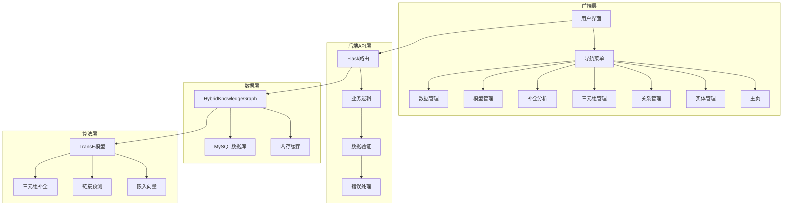
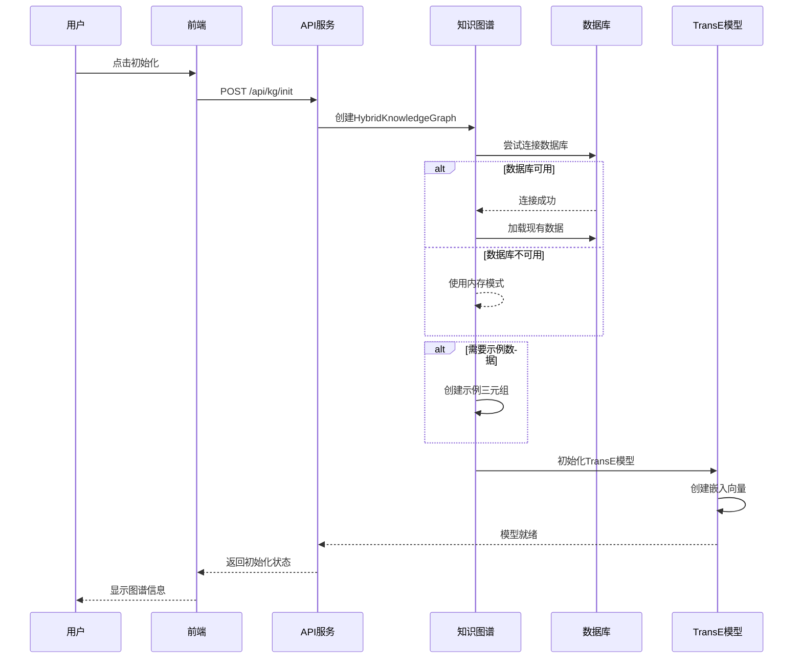
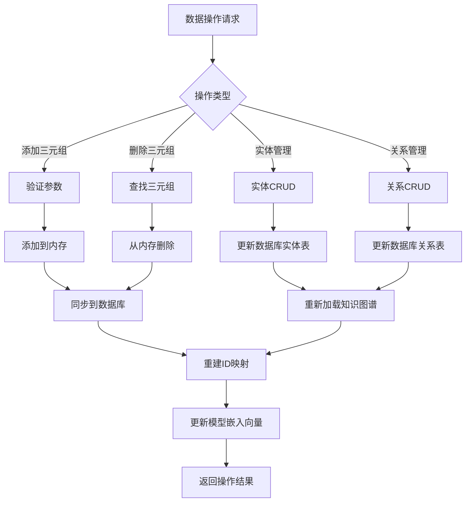
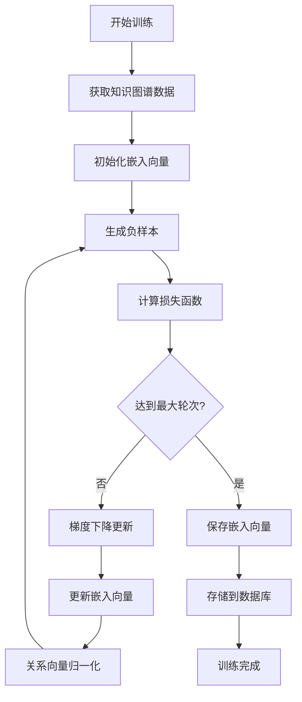
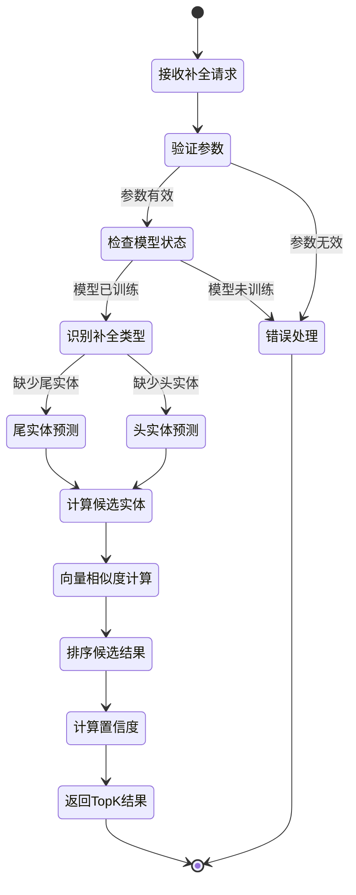
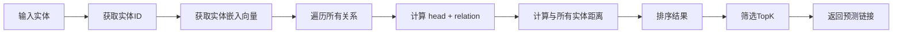
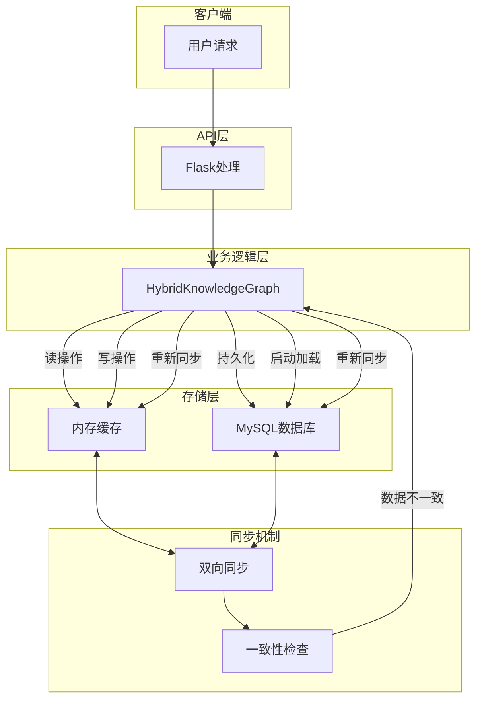
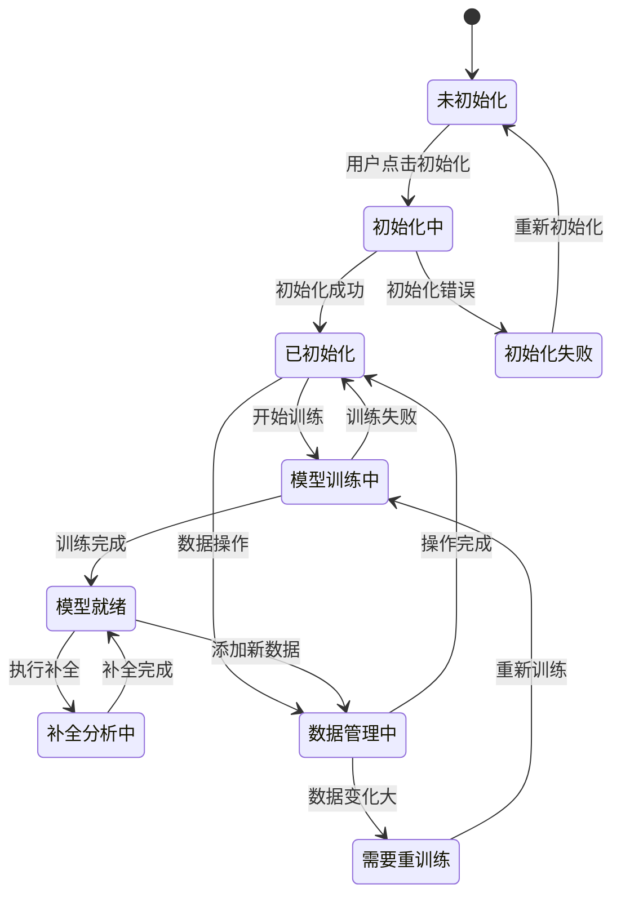

# KGC项目核心业务流程图

## 1. 系统整体架构流程

## 2. 知识图谱初始化流程

## 3. 数据管理核心流程

## 4. TransE模型训练流程

## 5. 知识图谱补全流程

## 6. 链接预测流程

## 7. 混合存储架构流程

## 8. 系统状态流转

## 核心流程说明

### 关键特性：
1. **双模式存储**: 内存+数据库混合架构，保证性能和持久化
2. **动态扩展**: 支持运行时添加新实体、关系和三元组
3. **智能补全**: 基于TransE算法的知识图谱补全
4. **实时同步**: 内存和数据库数据实时一致性
5. **状态管理**: 完整的系统状态流转和错误处理

### 数据流向：
- **输入**: 用户通过Web界面或API输入数据
- **处理**: Flask路由处理业务逻辑，调用知识图谱和模型
- **存储**: 内存快速操作，数据库持久化存储
- **输出**: 可视化展示和API响应结果

### 算法核心：
- **TransE训练**: 负采样、损失计算、梯度下降
- **嵌入表示**: 实体和关系的向量空间映射
- **相似度计算**: 欧氏距离或余弦相似度
- **预测排序**: 基于向量相似度的候选实体排序